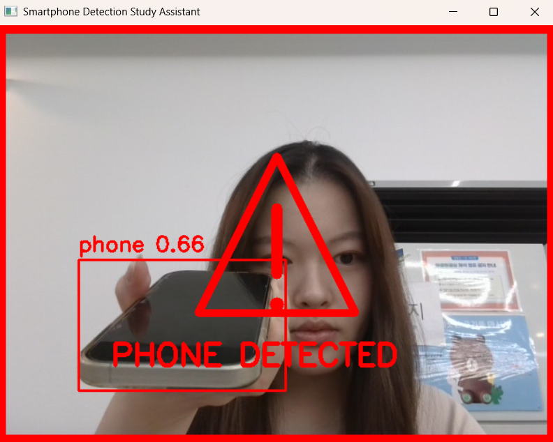
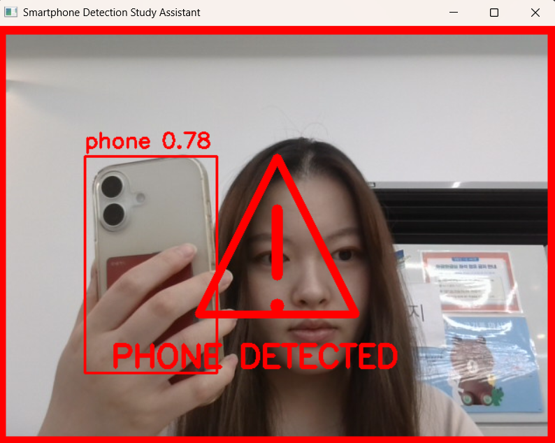
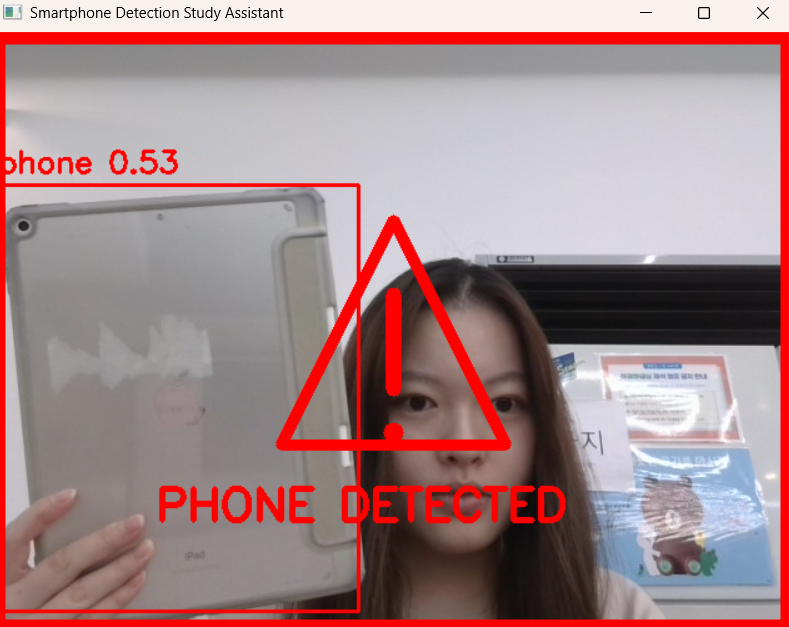

# Cell Phone Detection and warning

YOLOv8를 이용한 객체 탐지 모델과 웹캠을 이용하여
공부 중 스마트폰 사용을 실시간으로 탐지하는 프로젝트이다.

스마트폰이 감지되면 화면 테두리가 빨간색으로 변경되며, 화면 중앙에 경고 아이콘이 표시된다.

YOLOv8 객체 탐지 모델의 fine-tuning을 위해
kaggle의 cell phone object detection dataset을 활용하였다.
- https://www.kaggle.com/datasets/a165079/cellphoneobjectdetectionusingyolov7

총 515장의 train 이미지를 이용하여 모델을 학습하였으며, 
학습 경과 생성된 모델 파일이 best.pt 파일이다.

---

## 프로젝트 기능
- 웹캠 기반 실시간 스마트폰 탐지
- Custom YOLOv8 Fine-tuning
- 스마트폰 위치에 박스 표시
- 경고용 빨간 화면 테두리 출력
- 중앙 경고 아이콘 표시

---

## 사용 기술
- Python
- YOLOv8
- OpenCV
- Ultralytics

---

## 결과 사진

